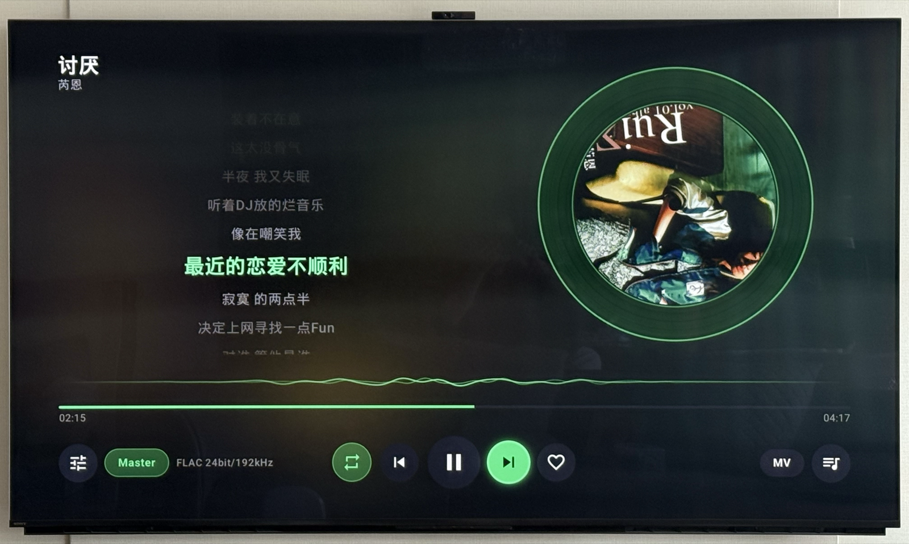

# 随便听 · walkman-tv

> 一款面向大屏、遥控器友好的 **原生 Android TV 音乐播放器**，使用 **Kotlin + Jetpack Compose for TV** 编写。

<p>
  <a href="https://github.com/SincereXing/walkman-tv/releases/latest"></a>
  <a href="https://github.com/SincereXing/walkman-tv/releases"></a>
  
  
  
  
  
</p>

主打「打开就能听、用方向键就能玩」：暗色界面、大封面、逐行滚动歌词、旋转黑胶，所有交互都为 D-pad（方向键 + OK + 返回）设计，适配客厅观看距离。保留 **洛雪音乐（lx-music）v4 自定义源的 JS 解析协议**，在此基础上**扩展了更多音质档位**。

> 🤖 本项目的**全部代码均由 [Claude Code](https://claude.com/claude-code) 生成**（含架构、UI、播放/下载/导入逻辑与本文档）。

---

## 📺 界面预览



---

## 📥 下载安装

前往 **[Releases](../../releases/latest)** 下载最新 APK，用 U 盘 / `adb install` 装到 Android TV 即可。

- **`walkman-tv-x.y.z-universal-release.apk`** —— 通用包，不确定机型就下它（体积稍大，任意 ABI 都能装）。
- **`walkman-tv-x.y.z-arm64-v8a-release.apk`** —— 现代电视/盒子（2018 年后，64 位 ARM），体积更小。
- **`walkman-tv-x.y.z-armeabi-v7a-release.apk`** —— 老的 32 位 ARM 机型。
- **`walkman-tv-x.y.z-x86_64-release.apk`** —— x86 盒子 / Android TV 模拟器。

> 安装：`adb connect <电视IP>` 后 `adb install walkman-tv-x.y.z-universal-release.apk`；或把 APK 拷到 U 盘，用电视上的「文件管理器 / 安装包安装器」打开。首次安装需在系统设置里允许「未知来源 / 安装未知应用」。

---

## ✨ 功能特性

| 分区 | 说明 |
|---|---|
| **推荐（首页）** | 左侧常驻「正在播放」面板（大封面 / 歌名歌手 / 当前歌词行 / 进度），右侧推荐卡片网格 + 已播·收藏统计 |
| **搜索** | 多平台聚合搜歌，可按单一音源筛选；支持**手机扫码输入**关键词（局域网推送，省去电视端打字） |
| **排行榜** | 各平台官方榜单浏览 → 榜内歌曲 → 播放 |
| **歌单广场** | 按标签 / 排序浏览歌单 → 歌单详情 → 整单播放 |
| **我的列表** | 我的收藏、**播放历史**（自动记录、去重置顶）、自建歌单；本地 JSON 持久化 |
| **下载** | 单曲 / **整单批量下载**（我的列表里「下载全部」，并发可配置、相同音质自动跳过、可选「按新音质重下」升级已下载）、多音质、文件夹分组、进度跟踪、断点状态恢复，并写入 **ID3v2.4 / FLAC** 元数据（标题/歌手/专辑/曲号/年份/封面/歌词）；**可在设置中选择下载目录**（内部存储 / SD 卡 / U 盘，或用系统文件夹选择器 SAF 指定任意可浏览文件夹） |
| **本地导入** | 通过 SAF 选择文件夹递归扫描导入本地音乐（mp3 / flac / m4a / wav…），自动读取内嵌标签 |
| **在线歌单导入** | 粘贴或扫码推送 **网易云 / QQ 音乐 / 酷狗 / 酷我** 的歌单分享链接，实时识别并一键导入为本地歌单 |
| **全屏播放器** | 模糊封面背景 + 旋转黑胶 + 逐行歌词 + 波形进度 + 传输控件 + 收藏；歌词字号可调（标准 / 大 / 最大） |
| **MV** | 取各平台 MV 地址，用 ExoPlayer 在视频层播放 |
| **设置 / 自定义源管理** | 音质偏好、发现页音源开关、内置直连兜底、歌词翻译、歌词大小，以及通过 **URL / 文件 / 扫码** 导入 lx-music v4 脚本 |

> 文字输入统一支持「手机扫码 → 局域网推送」：电视端展示二维码，手机访问内置轻量 HTTP 服务页面输入中文/链接后回传，避免在电视上用遥控器逐字敲。

---

## 🎵 支持的音乐平台

| 平台 | 代码 | 搜索 | 排行榜 | 歌单 | 在线歌单导入 |
|---|---|:--:|:--:|:--:|:--:|
| 酷我音乐 | `kw` | ✅ | ✅ | ✅ | ✅ |
| 酷狗音乐 | `kg` | ✅ | ✅ | ✅ | ✅ |
| QQ 音乐 | `tx` | ✅ | ✅ | ✅ | ✅ |
| 网易云音乐 | `wy` | ✅ | ✅ | ✅ | ✅ |
| 本地文件 | `local` | — | — | — | （本地导入） |

> 目录数据（搜索 / 排行榜 / 歌单）走各平台直连 API；播放地址解析优先走自定义源脚本，失败时回落到内置直连（kw / wy）兜底。

---

## 🎧 音质档位

8 级音质体系，从高到低排序，播放时按「目标音质 → 逐级降级」级联选取：

| 档位 | key | 显示名 | 角标 |
|---|---|---|---|
| 母带 | `master` | 臻品母带 | Master |
| 全景声 2.0 | `atmos_plus` | 臻品全景声 2.0 | Atmos |
| 全景声 | `atmos` | 臻品全景声 | Atmos |
| 高解析 | `hires` | Hi-Res 高解析 | Hi-Res |
| 24bit 无损 | `flac24bit` | Hi-Res 24bit | Hi-Res |
| 无损 | `flac` | 无损 FLAC | SQ |
| 高品 | `320k` | 高品 320k | HQ |
| 标准 | `128k` | 标准 128k | STD |

> 音质档位是开放的：**如需支持新增档位，只需在 js 自定义源脚本里声明该档位的 quality key（即脚本上报的 `sources[平台].qualitys` 列表中加上对应字符串，并在 `musicUrl` 解析里处理该 `type`），App 端在搜索 / 播放 / 下载 / Hi-Res 选档全链路即可直接使用，无需改动客户端。**

---

## 🎨 设计风格

- **纯暗色主题**，主品牌色为绿色 `#4ADE80`（焦点光晕 / 选中态 / 进度 / 当前歌词），危险操作用红 `#EF5A6F`、软提示用琥珀 `#E8B341`、信息用蓝 `#61AFEF`。
- **大屏 / 远距离阅读**：大圆角卡片、大封面、克制的层级与留白；各平台有独立标识色便于一眼区分来源。
- **遥控器优先**：顶部导航 pill + 内容区 + 全屏播放器覆盖层；列表用 `focusRestorer()` 记忆焦点，`focusProperties` 约束方向键出口，弹窗设默认焦点，OK = 主操作 / 返回 = 关闭。
- **动效**：焦点缩放 / 描边、黑胶旋转、歌词逐行滚动与渐隐聚焦当前行。

---

## ⚙️ 设置说明

所有设置都在顶部导航最右侧的 **设置（齿轮）** 里，改完即时生效、本地持久化。各项含义与默认值：

| 设置项 | 作用 | 默认值 |
|---|---|---|
| **播放音质** | 全局**目标音质上限**。播放/下载时每首歌取「≤ 此档的最佳可用音质」，不支持则自动逐级降级（master → … → 128k）。 | `Hi-Res 24bit`（flac24bit） |
| **发现页音源** | 推荐（首页）拉取数据用哪些平台，可多选开关（酷我 / 网易云 / 酷狗 / QQ）。至少保留一个。 | 四个全开 |
| **内置直连兜底** | 自定义源脚本解析失败时，是否尝试 kw/wy 的内置直连兜底。 | 开 |
| **歌词翻译** | 是否显示歌词的翻译行。 | 开 |
| **歌词大小** | 全屏播放器歌词字号：标准 / 大 / 最大。 | 标准 |
| **下载目录** | 下载保存位置：选一个存储卷（内部存储 / SD 卡 / U 盘），或用系统文件夹选择器（SAF）指定任意可浏览文件夹。切换只影响之后的下载。 | 应用专属音乐目录 |
| **下载并发数** | 同时下载的最大歌曲数（批量下载时排队），范围 1–6，越大越快越占带宽。 | 3 |
| **批量下载 · 已下载的也按新音质重下** | 歌单「下载全部」时，已下载但音质与所选不同的歌是否按新音质重下（如 128k 升级 FLAC）；关闭则一律跳过已下载。 | 开 |
| **自定义音源** | 导入 / 启停 / 删除 lx-music v4 脚本：粘贴 URL、直接粘贴脚本、上传 `.js`、或手机扫码操作。 | — |

> 常见操作速查：**改默认下载/播放音质** → 「播放音质」；**推荐页只想看某个平台** → 「发现页音源」只留它；**下载太慢/想更快** → 「下载并发数」调大；**升级整张歌单的音质** → 确认「按新音质重下」开着，进歌单「下载全部」选高音质即可。

---

## 🧩 自定义源（基于洛雪音乐 lx-music 协议）

本项目保留并复刻了 **洛雪音乐（lx-music）v4 用户脚本协议**，可直接加载社区常见的 lx-music 自定义源脚本：

- `source/js/JsScriptRuntime.kt` 用 `wang.harlon.quickjs:wrapper-android` 在 QuickJS 上下文中运行脚本，复刻预加载契约（`lx_setup` / `__lx_native__` / `__lx_native_call__*`）。
- HTTP 请求由 `ScriptHttpClient`（OkHttp）原生执行，对齐 lx-music-mobile 的默认 UA / Content-Type / JSON 解析规则。
- 加解密（AES / RSA / MD5 / Base64）通过 `CryptoBridge` 委托给随工程保留的 Java 辅助类。
- 自定义脚本负责**播放地址 + 歌词**解析；搜索 / 排行榜 / 歌单为平台直连。

**扩展点**：在原协议基础上，将音质体系从常见的 `128k / 320k / flac / flac24bit` **扩展到 8 级**（新增 `hires / atmos / atmos_plus / master`），并在搜索、播放、下载、Hi-Res 选档全链路打通这些扩展档位。脚本声明支持即可尝试，无需目录接口预先上报。

导入方式：设置页粘贴脚本 URL / 直接粘贴脚本内容 / 上传 `.js` 文件 / 手机扫码操作。

---

## 🛠 技术栈

- **Kotlin** + **Jetpack Compose for TV**（`androidx.tv:tv-material`）
- **Media3 ExoPlayer / Session**（后台播放 + MediaSession 遥控器控制，音视频共用同一 player）
- **Coil**（封面加载）+ 本地 RenderScript 模糊
- **OkHttp** + **kotlinx.serialization** + **Coroutines / StateFlow**
- **QuickJS**（`wang.harlon.quickjs`）运行自定义源脚本
- **NanoHTTPD** + **ZXing**（手机扫码 → 局域网推送输入）
- **DataStore / filesDir JSON** 持久化；**DocumentFile (SAF)** 本地导入
- 手写依赖容器 `AppContainer`（不引入 Hilt）

---

## 📦 项目结构

```
app/src/main/java/com/walkman/tv/
├── App.kt / MainActivity.kt          应用入口（QuickJSLoader + bootstrap）
├── di/                               AppContainer（手写 DI）/ LocalServer（扫码输入）/ AppEvents
├── data/model                        Track / SourceID / Quality / Playlist / Songlist / Downloads …
├── data/store                        Library / Settings / Script / Download / LocalFolder / CoverCache
├── crypto/AES.java + RSA.java        密码学辅助（被 JS 引擎调用）
├── source/js                         JsScriptRuntime / ScriptHttpClient / CryptoBridge
├── source/catalog                    各平台直连 API：搜索 / 排行榜 / 歌单 / MV
├── source/builtin                    kw·wy 直连兜底 + 直连歌词
├── source                            SourceManager（音质级联 + 换源）/ OtherSourceFinder
├── playback                          PlaybackController (Media3) / 下载 / 本地扫描 / 在线歌单导入 / LyricParser
├── ui                                RootScreen + TopNav + 各分区屏幕 + 全屏播放器 + 弹窗组件
└── assets/script/user-api-preload.js QuickJS 预加载脚本
```

---

## 🚀 构建与运行

环境：Android Studio（建议 JDK 17+），`compileSdk 35` / `minSdk 21` / `targetSdk 34`。

```bash
# 1. 配置本机 SDK
echo "sdk.dir=$ANDROID_HOME" > local.properties

# 2. 构建调试包
./gradlew assembleDebug

# 3. 安装到 Android TV 设备 / 模拟器（建议 Android TV 1080p, API 34）
./gradlew installDebug
```

正式打包（Release）：

```bash
# 正式 Release APK（按 ABI 拆分，产物在 app/build/outputs/apk/release/）
./gradlew assembleRelease

# 或打 Android App Bundle（上架用）
./gradlew bundleRelease
```

> 正式签名：在仓库根目录放一个 `keystore.properties`（含 `storeFile` / `storePassword` / `keyAlias` / `keyPassword`，指向你的 `release.keystore`），`assembleRelease` 会自动用它签名。**未提供时会回落到 debug 签名**，产物依然可直接安装（仅用于自测，不要用于上架）。

启动后落在「推荐」首页，方向键在导航 pill / 卡片 / 列表间移动焦点，OK 进入全屏播放器。

---

## 📌 致谢与声明

- 自定义源协议与预加载脚本来自 **[洛雪音乐 lx-music](https://github.com/lyswhut/lx-music-mobile)**，感谢其生态与社区脚本。本项目仅复刻其脚本运行契约以兼容现有自定义源，并未内置任何音源。
- 本项目为**学习与个人使用**目的的开源播放器，不提供、不内置任何版权音频资源；所有内容均由用户自行导入的自定义源或公开接口提供。请在所在地法律允许的范围内使用，支持正版音乐。
- 与上述任何音乐平台、洛雪音乐项目均无隶属或合作关系。

## 📄 License

[Apache License 2.0](LICENSE)
